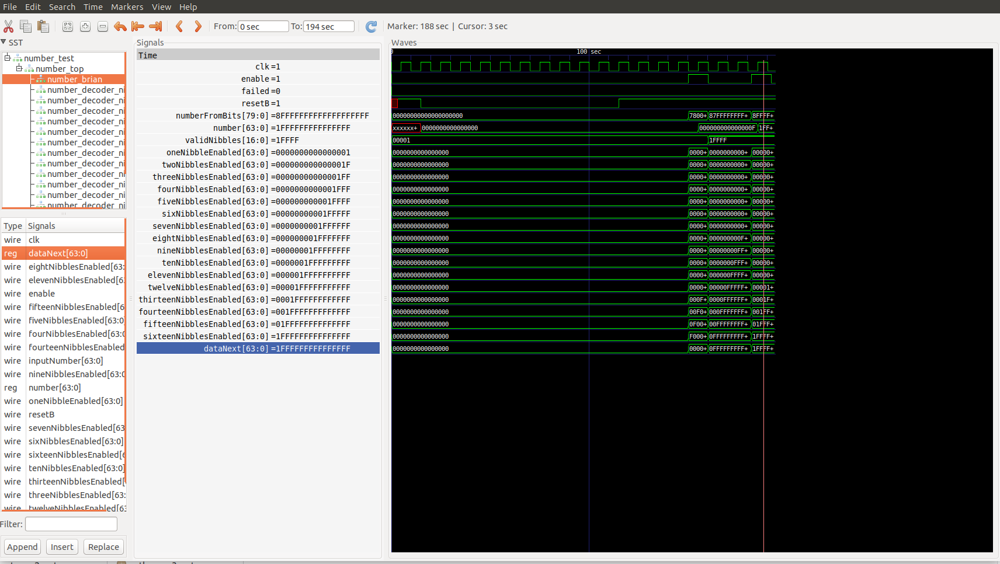

# aoc2021d16fpga
Advent of Code 2021, Day 16 done in work to be synthesizable and placed in a FPGA.

## Goal of this repository
To create an FPGA representation of the Buoyancy Interchange Transmission System (BITS) as
described in [Advent of Code, Year 2021, Day 16](https://adventofcode.com/2021/day/16).

## Directory Structure
* verilog - The actual verilog code that will be synthesizable
* testbench - Testbench of external devices to the verilog code that will be needed in the real world to make it
* design_docs - The design docs for each module.  This will include the register map.

## Timeline Goal
Have a working prototype of simulated in working with the BITS code for my individual problem by 
Three Kings Day 2022 (January 6, 2022).

## Tools
* [Icarus Verilog](http://iverilog.icarus.com/home)
* Waveform Viewer: [GTKWave](http://gtkwave.sourceforge.net/)

## How to run
* Following installation instructions for Icarus Verilog and Waveform Viewer.
* After installing Icarus and GTKWave, you can run the following commands:

```
iverilog testbench/number_test.v verilog/number_top.v verilog/number_brian.v verilog/number_decoder.v
vvp a.out
gtkwave number.vcd &
```

This should bring up a waveform viewer that you should be able to navigate.  For the initial run, the following
waveform was produced:



